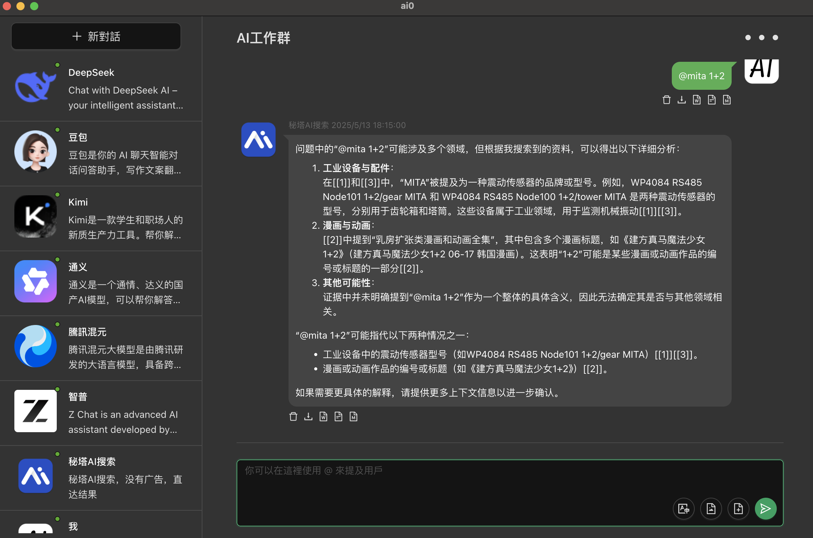

# ai0

本工具包裝了DeepSeek、豆包、kimi等AI大模型，可以在群組裡指揮他們，讓他們為你工作；可以一鍵導出到word、excel、txt等，並保留美化後的樣式。

- 不收集任何用戶信息，完全本地運行
- 支持多個大模型單獨或同時發起請求
- 支持一鍵複製到word、excel、txt
- 支持一鍵下載MarkDown格式到本地
- 支持大模型返回數據自動保存到本地
- 支持群組對話方式樣式，表現更有趣

---

[github](https://github.com/lizongying/ai0/)

[gitlink](https://www.gitlink.org.cn/lizongying/ai0/)

---

## 注意

- 不支持多開。請只開啟一次本軟件，若存在已經開啟的本軟件，請關閉後再重新啟動。
- 如果沒有輸出，請點擊頭像打開官網窗口進行檢查，有時AI會要求驗證碼或者登陸。建議登錄後使用。

## 下載地址

[github](https://github.com/lizongying/ai0/releases)

[gitlink](https://www.gitlink.org.cn/lizongying/ai0/releases)

## 更新日志

[更新日志](./HISTORY.md)

## 待完成

- 初始化提示詞
- 歷史記錄搜索
- 上傳圖片、文件
- 增加引用
- 超時等錯誤處理
- 工具

- kimi (\boxed{9})
- kimi [^10^]

## 讚賞

